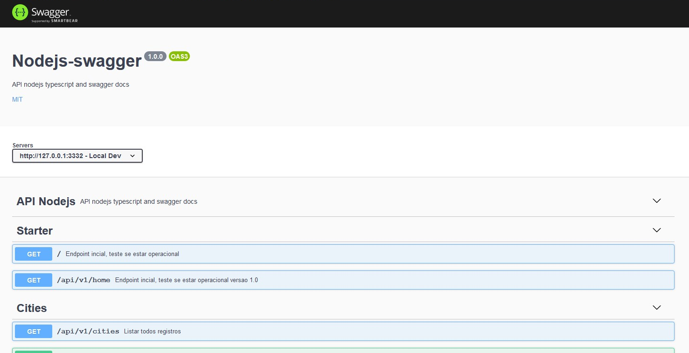

<h2  align="center">

</h2>

  
<p  align="center">
<a  href="#-projeto">Projeto</a>&nbsp;&nbsp;&nbsp;|&nbsp;&nbsp;&nbsp;
<a  href="#-tecnologias">Tecnologias</a>&nbsp;&nbsp;&nbsp;|&nbsp;&nbsp;&nbsp;
<a  href="#-codigo">Código</a>&nbsp;&nbsp;&nbsp;|&nbsp;&nbsp;&nbsp;
<a  href="#-build">Build</a>&nbsp;&nbsp;&nbsp;|&nbsp;&nbsp;&nbsp;
<a  href="#-licença">Licença</a>
</p>

  

## 💻 Projeto
  

Este projeto é uma aplicação NodeJS com typescript implementando swagger, para entendermos e praticarmos o uso em criação da docuemntação API.
  

## 🧪 Tecnologias

  

  

O projeto foi desenvolvido usando as seguintes tecnologias:

  

- [Node.js](https://nodejs.org/)

  

- [Express](https://expressjs.com/pt-br/)

  

- [TypeScript](https://www.typescriptlang.org/)

  

- [Swagger](https://swagger.io/)

  

  

## 🚀 Código

  

Abra o console, e navegue ate a pasta desejada, crie um diretório do projeto e entre na pasta criada.
 

```bash
mkdir meuprojeto && cd meuprojeto
```

 Execute o comando **npm init -y** para criar o arquivo package.json, nele podemos definir nome do projeto, versão, script etc.
 
```bash
npm init -y
```

Crie uma pasta na raiz do projeto chamada **src** e dentro crie a seguinte estrutura que posteriormente criaremos mais arquivos.

```bash
-src
--routes
---index.ts
--swagger
---swagger.json
```
  

  
Instale as seguintes dependências
 

```bash
yarn add express body-parser cors dotenv swagger-ui-express
yarn add --dev @types/express  @types/node  @types/cors  @types/swagger-ui-express nodemon typescript
```

  

Na raiz do projeto crie um arquivo **tsconfig.json**, verifique o conteúdo neste próprio repo com as configurações. Com isso nosso projeto estará rodando com typescript sendo assim lembrar das tipagens e utilizar arquivos com extensão .ts.
```js
{
    "compilerOptions": {
      "target": "es5",
      "lib": [ "es2015" ],
      "module": "commonjs",
      "outDir": "./dist",
      "rootDir": "./src",
      "baseUrl": ".",
      "allowJs": true,
      "strict": true,
      "strictPropertyInitialization": false,
      "esModuleInterop": true,
      "forceConsistentCasingInFileNames": true,
      "emitDecoratorMetadata": true,
      "experimentalDecorators": true,
      "resolveJsonModule": true,
      "noImplicitAny": true,
      "typeRoots": ["./@types"]
    },
    "include": [
      "src/**/*"
    ]
  }
```
  
Na pasta **/src** crie um arquivo chamado **server.ts** com o conteudo a seguir, este será nosso start do servidor.
```js
import dotenv from 'dotenv';
dotenv.config();
import express,  { Request, Response, NextFunction } from "express";
import bodyParser from 'body-parser';
import cors from 'cors';


const app = express();


// Tratamento de Cors, lliberação ou bloqueio de acessos externos
app.use(cors());

app.use(bodyParser.json({limit: "50mb"}));
app.use(bodyParser.urlencoded({limit: "50mb", extended: true, parameterLimit:50000}));

app.get('/', (req: Request, res: Response, next: NextFunction) => {
    return res.status(200).json({ message: "Servico em Operação" })
  });


const port = process.env.PORT || 3332;


app.listen(port, () => {
  console.log(`🏃 Server Running at http://localhost:${port}`);
});
```

Crie um arquivo na raiz chamado **nodemon.json** para configurar o nodemon para quando rodarmos o servico, ele atualizar a cada alteração executada restartando o serviço.
```js
{
    "watch": "src/**/*.ts",
    "execMap": {
      "ts": "ts-node"
    }
  }
```


Crie um script **dev** no package.json para rodar em modo de desenvolvimento.
```js
 "scripts": {
    "dev": "nodemon --watch src/ --exec ts-node src/server.ts -e ts",
    "test": "echo \"Error: no test specified\" && exit 1"
  },
```
*Execute o script **yarn dev** ou **npm run dev** para rodar o serviço e conferir se está rodando e tudo em ordem.*
  

Vamos criar algumas rotas para usarmos estas para documentar com o swagger, na pasta **/src/routes** crie um arquivo chamado **index.ts**
Na pasta **/src/routes** crie um arquivo chamado **cityroutes.ts**.
*o arquivo index ficara assim:*
```js
import express, { Request, Response, NextFunction } from 'express';
const routes = express.Router();
import cityroutes from './cityroutes';

routes
  .get('/', (req: Request, res: Response, next: NextFunction) => {
    return res.status(200).json({ message: "Servico em Operação" })
  });

routes
  .get('/api/v1/home', (req: Request, res: Response, next: NextFunction) => {
    return res.status(200).json({ message: "Servico em Operação Home Api V1" })
  });

routes.use('/api/v1', cityroutes);

routes
  .get('*', (req: Request, res: Response, next: NextFunction) => { return res.status(404).json({ message: `Não existe rota para a requisição solicitada ${req.url}, verifique.` }) })
  .post('*', (req: Request, res: Response, next: NextFunction) => { return res.status(404).json({ message: `Não existe rota para a requisição solicitada ${req.url}, verifique.` }) });


export default routes;

```
*o arquivo cityroutes ficara assim:*
```js
import express, { Request, Response, NextFunction } from 'express';

const cityroutes = express.Router();

cityroutes
  .get('/cities', (req: Request, res: Response, next: NextFunction) => {
    let data = [
      { id: 1, name: 'Nova Venécia', uf: "ES" },
      { id: 2, name: 'São Gabriel', uf: "ES" },
      { id: 3, name: 'Boa Esperança', uf: "ES" },
      { id: 4, name: 'São Mateus', uf: "ES" }
    ]

    return res.status(200).json(data);
  });

cityroutes
  .post('/cities', (req: Request, res: Response, next: NextFunction) => {
    let data = { id: 1, name: 'Nova Venécia', uf: "ES" }
    return res.status(200).json({ message: "Cadastrado com Sucesso!", data });
  });

export default cityroutes;
```


No arquivo **/src/server.ts** vamos importar as rotas e usa-la no servico, e implementar tambem a importação do swagger.
*crie na pasta **/src/swagger** um arquivo **swagger.json** *
```js
{
    "openapi": "3.0.0",
    "info": {
        "version": "1.0.0",
        "title": "Nodejs-swagger",
        "description": "API nodejs typescript and swagger docs",
        "license": {
            "name": "MIT",
            "url": "https://opensource.org/licenses/MIT"
        }
    },
    "servers": [
        {
            "url": "http://127.0.0.1:3332",
            "description": "Local Dev"
        }
    ],
    "tags": [
        {
            "name": "API Nodejs",
            "description": "API nodejs typescript and swagger docs"
        }
    ],
    "consumes": [
        "application/json"
    ],
    "produces": [
        "application/json"
    ]
}
```
*O arquivo **/src/server.ts** ficará assim:*
```js
import dotenv from 'dotenv';
dotenv.config();
import express from "express";
import bodyParser from 'body-parser';
import cors from 'cors';
import swaggerUi from 'swagger-ui-express'
import * as swaggerFile from './swagger/swagger.json'

import routes from './routes/index';

const app = express();

// Tratamento de Cors, lliberação ou bloqueio de acessos externos
app.use(cors());

app.use(bodyParser.json({limit: "50mb"}));
app.use(bodyParser.urlencoded({limit: "50mb", extended: true, parameterLimit:50000}));

app.use('/docs', swaggerUi.serve, swaggerUi.setup(swaggerFile))
app.use(routes);


const port = process.env.PORT || 3332;


app.listen(port, () => {
  console.log(`🏃 Server Running at http://localhost:${port}`);
});
```

Observe que no arquivo **/src/server.ts** foi criado uma rota **/docs** onde será direcionado a uma UI com a documentação em si, este ler a biblioteca do swagger e o arquivo **/src/swagger.json** gerando assim a documentação, para que as rotas criadas apareçam de acordo e geramos as infos necessária no arquivo **swagger.json** vamos detalhar as rotas, nomes, descrição, parametros, body, etc tudo em formato JSON para que seja gerado a interface, duvidas acesse a documentação da biblioteca swagger para mais detalhes de como deve proceder, agora vamos inserir no arquivo **/src/swagger.json** o laço path com o codigo abaixo.


```js
{
"openapi": "3.0.0",
"info": {...},
"servers": [{...}],
"tags": [{...}],
"consumes": [...],
"produces": [...],
// Abaixo o código inserido (lembrar de fechar a chave json corretamente no final)
 "paths": {
        "/": {
            "get": {
                "tags": [
                    "Starter"
                ],
                "summary": "Endpoint incial, teste se estar operacional",
                "responses": {
                    "200": {
                        "description": "Serviço em Operação",
                        "schema": {}
                    }
                }
            }
        },
        "/api/v1/home": {
            "get": {
                "tags": [
                    "Starter"
                ],
                "summary": "Endpoint incial, teste se estar operacional versao 1.0",
                "responses": {
                    "200": {
                        "description": "Servico em Operação Home Api V1",
                        "schema": {}
                    }
                }
            }
        },
        "/api/v1/cities": {
            "get": {
                "tags": [
                    "Cities"
                ],
                "summary": "Listar todos registros",
                "responses": {
                    "200": {
                        "description": "Listagem de registros"
                    },
                    "400": {
                        "description": "Falha ao listar registros."
                    }
                }
            },
            "post": {
                "tags": [
                    "Cities"
                ],
                "summary": "Cadastrar um registro",
                "requestBody": {
                    "description": "Objeto a ser enviado",
                    "required": true,
                    "content": {
                        "application/json": {
                            "schema": {
                                "type": "object",
                                "properties": {
                                    "name": {
                                        "type": "string"
                                    },
                                    "uf": {
                                        "type": "string"
                                    }
                                }
                            }
                        }
                    }
                },
                "responses": {
                    "200": {
                        "description": "Registro cadastrado com sucesso!"
                    },
                    "400": {
                        "description": "Falha ao realizar atualização de registro."
                    }
                }
            },
            "put": {
                "tags": [
                    "Cities"
                ],
                "summary": "Atualizar um registro",
                "parameters": [
                    {
                        "in": "body",
                        "name": "id",
                        "description": "Id do registro a ser atualizado",
                        "required": true,
                                "schema": {
                                    "properties": {
                                        "id": {
                                            "type": "integer"
                                        }
                                    }
                                }
                    }
                ],
                "requestBody": {
                    "description": "Objeto a ser enviado",
                    "required": true,
                    "content": {
                        "application/json": {
                            "schema": {
                                "type": "object",
                                "properties": {
                                    "name": {
                                        "type": "string"
                                    },
                                    "uf": {
                                        "type": "string"
                                    }
                                }
                            }
                        }
                    }
                },
                "responses": {
                    "200": {
                        "description": "Registro atualizado com sucesso!"
                    },
                    "400": {
                        "description": "Falha ao realizar atualização de registro."
                    }
                }
            }
        }
    }
    }
```

Agora com tudo devidamente configurado em seus detalhes, podemos rodar o serviço e conferir na rota **http://127.0.0.1:3332/docs** a docuemntação gerada de nossa api, assim podemos, ver os detalhes de cada rota, conforme setado no **swagger.json** e ate testar cada endpoint pela própria docuemntação.

```js
yarn dev
```
  

## 🚀 Build

Para realizar o build, crie um script no arquivo **package.json** e basta executa-lo e será feito o build

```js
 "scripts": {
    "dev": "nodemon --watch src/ --exec ts-node src/server.ts -e ts",
    "build": "rm -rf dist && tsc",
    "run-prod": "ts-node-dev dist/server.js",
    "test": "echo \"Error: no test specified\" && exit 1"
  },
```

```bash
$ yarn build
```

    

## 📝 Licença 
 

This project is licensed under the MIT License. See the [LICENSE](LICENSE.md) file for details.

  ---


<p  align="center">Made with 💜 by <a  href="https://github.com/hog099"  target="_blank">Hudson Oliveira</a></p>